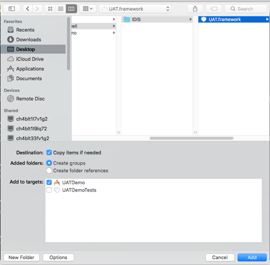

# 快速集成

## 第一步 下载SDK组件包

通过[下载链接](https://www.pgyer.com/UATDEMO)得到UAT.framework SDK组件包

## 第二步 将组件包添加至目标工程

 XcodeFile —&gt; `Add Files to "Your Project"`，在弹出Panel选中所下载组件包－&gt;Add。（注：选中“Copy items if needed”）



## 第三步 初始化组件包

#### 接口函数

```text
/** Initial IDIS Component
 @param appKey AppKey applied by developers on IDIS.
 @param channel Channel logo, you can set nil to mean "App Store".
 */
+ (void)initWithAppkey:(NSString *)appKey channel:(NSString *)channel;

```

#### 示例代码

```text
#import <UAT/HWUATSDKManager.h>

- (BOOL)application:(UIApplication *)application didFinishLaunchingWithOptions:(NSDictionary *)launchOptions {
[HWUATSDKManager initWithAppkey:@"Your Appkey" channel:@"App Store"];
}

```

